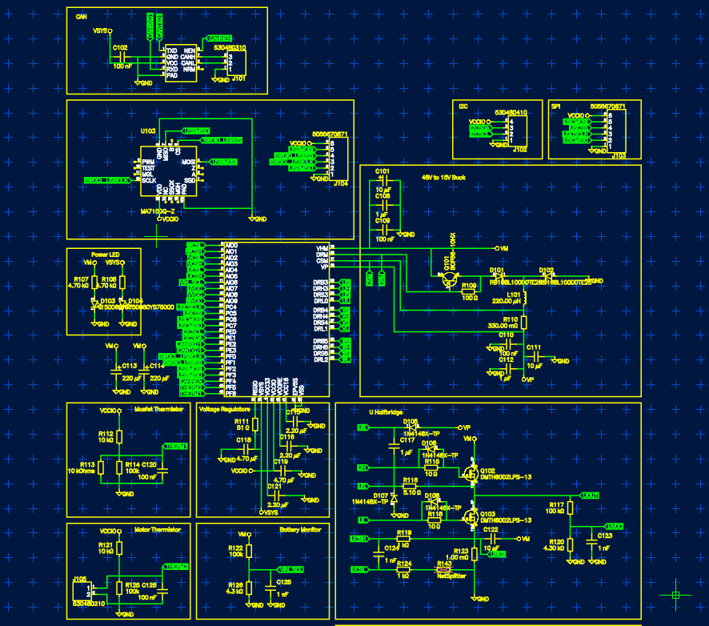
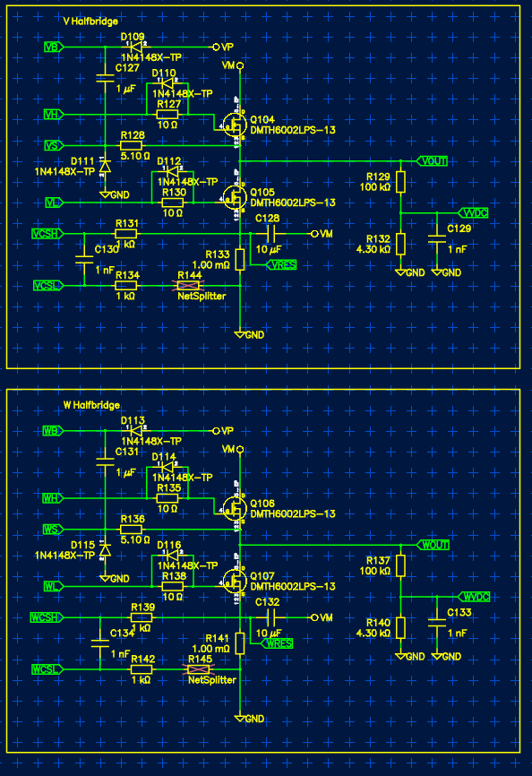
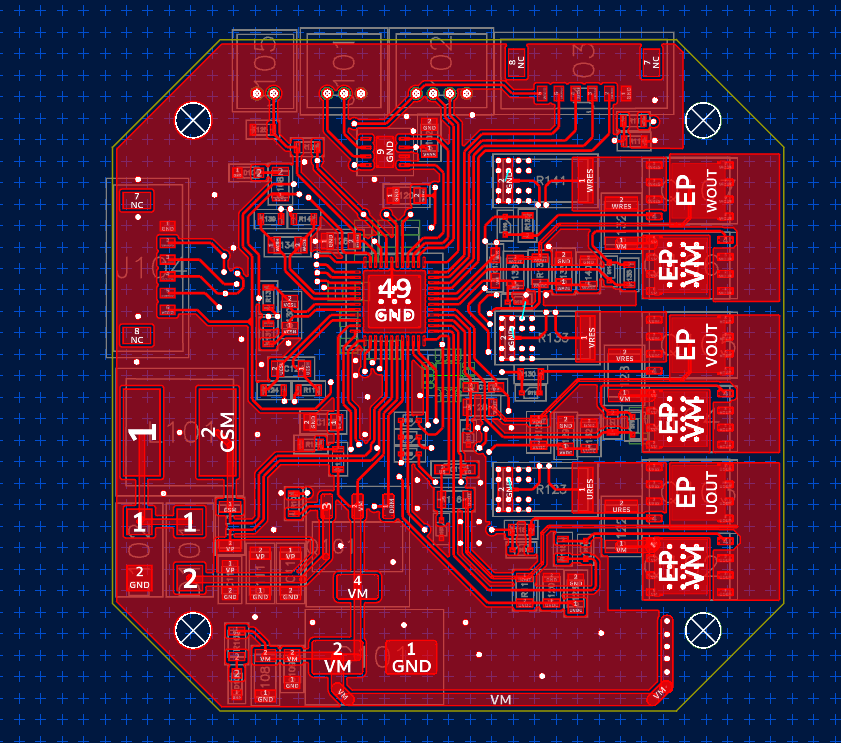
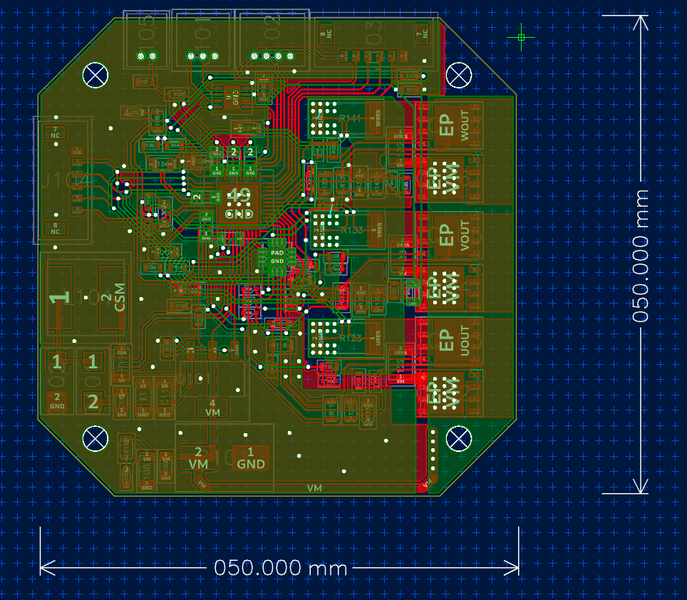
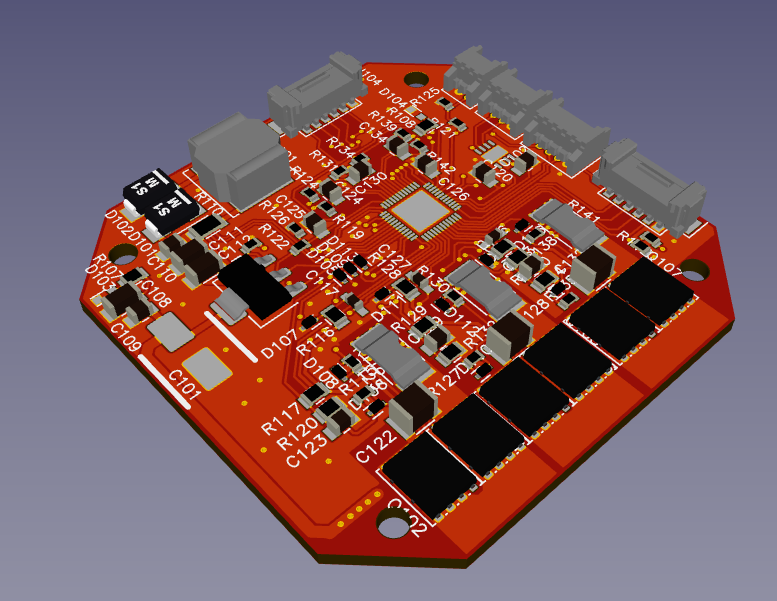
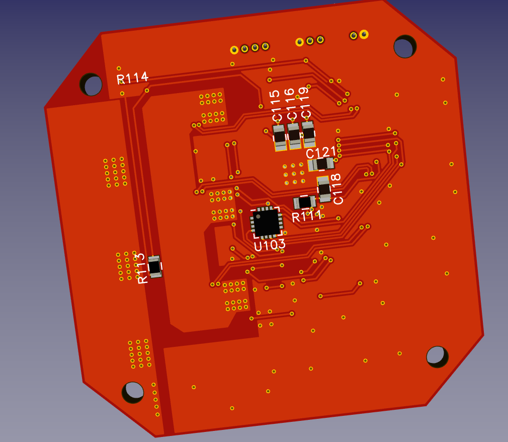

# Red Queen Actuator Controller

This is a BLDC Motor controller capable of driving 48 V motors at a peak current of 70 A.

The mosfets used have an R_DS(ON) resistance of 2m Ohm. (A lot I know)

At peak this means 10 W of power dissipation so you are going to need some serious cooling if you are going to be driving a motor at 3360 kW.

This BLDC Motor controller is unfinished and development has been abandoned.

## Schematic:

## PCB

## 3D

